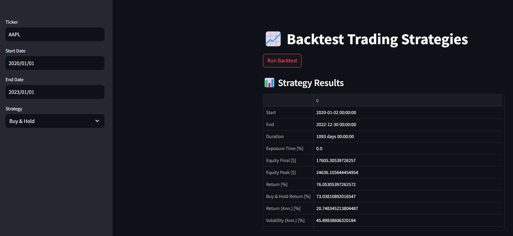
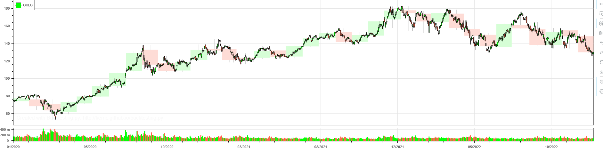

# 📈 Backtest Trading Strategies

A simple and interactive web app built with **Streamlit** that lets you backtest trading strategies using historical stock data from **Yahoo Finance**. Choose from multiple strategies, input your ticker and date range, and visualize performance metrics and equity curves—all in your browser.

---

## 🖼️ Screenshots

### 🎛️ User Interface

---

### 📉 Strategy Results & Equity Curve

---

## 🚀 Features

- 🔍 **Select any stock ticker** (e.g., AAPL, TSLA)
- 📅 **Choose custom start and end dates**
- 🧠 **Pick from 3 built-in strategies:**
  - Buy & Hold
  - SMA Crossover
  - RSI Strategy
- 💹 **View strategy results**, including:
  - Total Return
  - Annual Return
  - Volatility
  - Sharpe Ratio
- 📊 **Interactive equity curve plot** (powered by Bokeh)

---

## 🧰 Technologies Used

- Python
- [Streamlit](https://streamlit.io/)
- [yfinance](https://pypi.org/project/yfinance/)
- [Backtesting.py](https://github.com/kernc/backtesting.py)
- pandas, Bokeh

---
